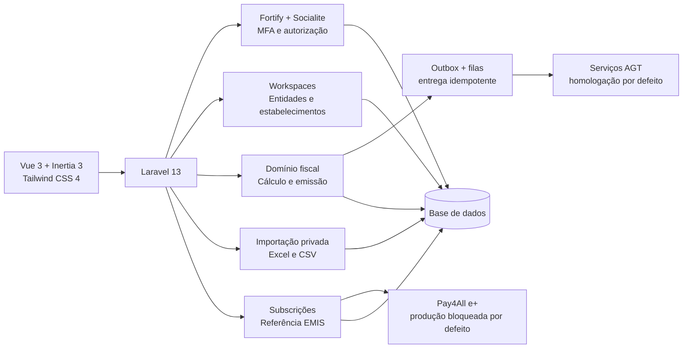

<div align="center">

<picture>
  <source media="(prefers-color-scheme: dark)" srcset="public/brand/facturac-ao-dark.svg">
  
</picture>

# facturac.ao

**Facturação electrónica para Angola. Feito para humanos. Aceite pela AGT.**

Uma plataforma SaaS multiempresa para emitir documentos fiscais, comunicar com a AGT, cobrar subscrições por Referência EMIS e migrar dados com segurança.


</div>

> [!IMPORTANT]
> O facturac.ao está em desenvolvimento activo e preparado para trabalho de homologação. Este repositório não declara certificação, validação ou autorização de produção pela AGT. As ligações de produção à AGT e à Pay4All permanecem bloqueadas por defeito até existirem credenciais, contratos, testes e aprovações aplicáveis.

## O produto

O facturac.ao foi desenhado para empreendedores, pequenas e médias empresas e equipas de contabilidade em Angola. Combina uma experiência simples em português com controlos fiscais, rastreabilidade e isolamento rigoroso entre empresas.

### Capacidades implementadas

| Área                     | O que já funciona                                                                                                                                     |
| ------------------------ | ----------------------------------------------------------------------------------------------------------------------------------------------------- |
| Identidade e acesso      | Registo, verificação de email, recuperação de palavra-passe, MFA/TOTP, códigos de recuperação, confirmação de palavra-passe e login Google            |
| SaaS multiempresa        | Workspaces, entidades legais, estabelecimentos, mudança de empresa, papéis e políticas de autorização                                                 |
| Preparação fiscal        | Perfil do contribuinte, NIF, regime fiscal, CAE, moeda AOA, fuso horário de Luanda e estabelecimento sede                                             |
| Ligação AGT              | Ambiente de homologação, credenciais protegidas, referências para chaves PEM fora da base de dados, testes de conectividade e sincronização de séries |
| Documentos fiscais       | Rascunhos, linhas, descontos, impostos, totais determinísticos, numeração de séries e emissão imutável                                                |
| Submissões AGT           | Outbox transaccional, assinatura JWS, filas, repetição segura, idempotência, consulta de estado e monitor operacional                                 |
| Cobrança SaaS            | Planos, subscrições e Referências EMIS através da fronteira Pay4All e+; simulador local seguro enquanto a API comercial não está autorizada           |
| Importação de dados      | Clientes, produtos e serviços via XLSX, XLS ou CSV, com mapeamento, validação por linha, SHA-256, staging privado e confirmação idempotente           |
| Auditoria e notificações | Registo de actividades atribuível, eventos fiscais, histórico de pagamentos e notificações persistentes                                               |
| Experiência              | Interface responsiva, acessível, com modo escuro, temas, componentes Tailwind Plus, ícones Lucide e linguagem orientada ao utilizador                 |

## Arquitectura



O backend mantém as regras fiscais no servidor. A interface nunca é a fonte de verdade para totais, permissões, numeração ou estado de submissão.

## Estado das fases

|    Fase | Entrega                                                                    | Estado                    |
| ------: | -------------------------------------------------------------------------- | ------------------------- |
|       0 | Investigação, matriz de conformidade, decisões de arquitectura e protótipo | Implementada              |
|       1 | Identidade, MFA, login social, tenancy e onboarding                        | Implementada              |
|       2 | Configuração e verificação da ligação AGT                                  | Implementada              |
|       3 | Cadastro e rascunhos de documentos fiscais                                 | Implementada              |
|       4 | Emissão, assinatura, submissão e monitor AGT                               | Implementada              |
|       5 | Subscrições por Pay4All e+ / Referência EMIS                               | Implementada em simulação |
|       6 | Migração assistida de clientes, produtos e serviços                        | Implementada              |
| Próxima | SAF-T (AO), validação de esquema e fluxo controlado de entrega             | Planeada                  |

Os documentos de governação e conformidade estão em [`docs/phase-0`](docs/phase-0/README.md).

### Checkpoint da integração AI — Phase 7B.3c-1

**Aceite e congelada.** Revisão de segurança concluída; o bloqueador de segurança (M1, enquadramento HTTP ambíguo) e a falha de fixture M2 foram corrigidos e verificados. Nenhum bloqueador de aceitação permanece. A arquitectura original da Phase 1 continua aprovada.

O [relatório final](docs/phase-7b-3c-1-final-checkpoint.md) e a [evidência verificável](docs/phase-7b-3c-1-final-checkpoint-evidence.json) identificam o estado exacto por hashes, o veredicto, os testes, as falhas históricas e as execuções particionadas. Não foi criado commit nem efectuado push, deployment ou activação. Verificação de fornecedor e inferência permanecem desactivadas.

**Backlog de fases posteriores:** Phase 7B.3c-2, consumo de credenciais pelo gateway, fornecedores adicionais, nova UI, activação em produção e limpeza de lint não relacionada. Nenhum destes trabalhos é autorizado por este checkpoint.

**Pré-requisitos para uma decisão posterior de activação:** entitlement exacto de conta/workspace/modelo; responsável e orçamento; decisões de privacidade, retenção e geografia; custódia dos segredos de runtime e prova de uma única autoridade PostgreSQL primária; ensaio controlado autorizado e plano de reversão. Evidência offline não substitui estas aprovações operacionais.

### Disposição do desenho — Phase 7B.3c-2

**Desenho concluído; implementação não iniciada nem autorizada.** O [desenho de consumo de credenciais pelo gateway](docs/phase-7b-3c-2-gateway-consumption-design.md) (2026-10-09) define a resolução determinística VAP/cliente sem fallback, a autoridade de invocação de uso único e o ponto exacto de linearização antes do envio. Veredicto: pronto para implementação, sem bloqueadores de desenho. Foi apenas documentação: nenhum código, teste, migração, dependência ou configuração foi alterado. O checkpoint 7B.3c-1 permanece congelado (inventário de 802 ficheiros e 14 hashes congelados verificados sem desvios). Verificação de fornecedor e inferência permanecem desactivadas.

**Pacote de revisão da migração preparado; nada executado.** O [pacote de revisão](docs/phase-7b-3c-2-migration-review-package.md) e a respectiva [evidência](docs/phase-7b-3c-2-migration-review-evidence.json) contêm o DDL concreto da migração aditiva `invocation_authority_v1` apenas como listagens: nenhuma migração foi criada ou aplicada e nenhuma listagem foi executada ou analisada pelo PostgreSQL. Todos os testes propostos estão por executar.

**Revisão do DDL: alterações exigidas.** A [revisão pré-execução](docs/phase-7b-3c-2-migration-ddl-review.md), com ensaio numa base de dados descartável, confirmou o comportamento do DDL em todos os casos ensaiados, mas encontrou dois defeitos no pacote: os nomes propostos dos ficheiros de migração quebrariam um teste congelado, e reverter as migrações 3c-1 sem reverter primeiro a sucessora deixaria o caminho legado avariado. A lista finita de alterações está na revisão. Esta revisão foi feita pelo mesmo autor do pacote, pelo que não é independente; nada foi executado fora da base descartável.

**Pacote corrigido (revisão 2) e novamente ensaiado.** As cinco alterações exigidas foram aplicadas ao [pacote](docs/phase-7b-3c-2-migration-review-package.md): os ficheiros de migração passam a conter `_ai_verification_` no nome e o novo trigger tem uma cláusula `WHEN`, pelo que uma reversão fora de ordem das migrações 3c-1 é recusada em vez de avariar o caminho legado. As listagens revistas foram ensaiadas numa base de dados descartável (instalação, 53 casos, quatro corridas concorrentes, reversão fora de ordem e ida-e-volta do catálogo), sem resultados inesperados. A revisão anterior descreve a revisão 1 do pacote e fica como registo histórico. Continua a não existir ficheiro de migração nem execução fora da base descartável, e todos os testes propostos estão por executar.

**Revisão independente da revisão 2: alterações exigidas, apenas de texto.** Um revisor separado, que leu os documentos do autor mas não leu nem reutilizou os seus scripts, [reviu e ensaiou](docs/phase-7b-3c-2-migration-ddl-review-r2.md) a revisão 2 na sua própria base descartável. É outro agente da mesma família de modelos, não uma pessoa nem uma organização diferente. As listagens comportaram-se como especificado em tudo o que executou, incluindo os testes congelados 3c-1 com as migrações propostas presentes numa cópia de trabalho. Exigiu três correcções de texto: o pacote afirmava que as leituras `FOR SHARE` tardias não podiam formar um ciclo de bloqueios, e podem, para um escritor que não tome primeiro os bloqueios canónicos; a matriz de bloqueios estava incompleta; e um teste proposto não tinha resultado esperado. A revisão 3 do pacote aplicou-as sem alterar nenhuma listagem. No seguimento, o revisor confirmou que as três estavam fechadas mas exigiu três correcções ao nível da frase introduzidas pela própria revisão 3: uma afirmação errada (nem todos os escritores definem um tempo-limite de bloqueio) e um resumo da revisão que dizia mais do que o revisor estabeleceu. A revisão 4 corrige-as; os três hashes das listagens continuam idênticos desde a revisão 2.

**Revisão 4 aprovada pelo revisor para execução delimitada.** O revisor confirmou que as correcções estão fechadas, que os hashes das três listagens são idênticos aos que ensaiou e que não encontrou nada de novo errado. A aprovação cobre apenas a implementação delimitada descrita no §17 do desenho, sob a condição de que todo o escritor tome os bloqueios canónicos antes da primeira escrita; não autoriza activação. Fica por verificar tudo o que o revisor lista como não verificado, em particular qualquer escritor PHP de inferência, que ainda não existe, e a execução em volume real.

**Implementação iniciada e suspensa (2026-10-10).** A pedido do responsável do projecto, a implementação foi interrompida a meio por não constar do plano mestre do produto (chaves de IA geridas pelo cliente não são necessárias para concluir a aplicação). O código foi reposto no estado do checkpoint 3c-1 (802 ficheiros e 14 hashes congelados verificados) e o trabalho parcial ficou guardado, inactivo, em [`docs/parked/phase-7b-3c-2`](docs/parked/phase-7b-3c-2/README.md): as duas migrações revistas, as classes do consumidor ainda sem testes e um patch das alterações a ficheiros existentes. Nada foi executado fora de bases descartáveis; verificação de fornecedor e inferência permanecem desactivadas. Retomar exige nova decisão do responsável do projecto.

**Trabalho adiado:** registo de reconhecimentos e aprovações de inferência e respectiva UI; contabilidade gateway-v1 para o modo VAP; perfis de cliente não equivalentes ao perfil Anthropic aceite; fornecedores adicionais; workers de longa duração; activação em produção e os pré-requisitos operacionais acima.

## Stack

- PHP 8.4 e Laravel 13
- Vue 3, TypeScript e Inertia.js 3
- Tailwind CSS 4, Tailwind Plus e Lucide
- Laravel Fortify, Socialite e Wayfinder
- Spatie Laravel Activitylog
- Laravel Excel / PhpSpreadsheet
- ECharts 6
- Pest 5, Larastan/PHPStan, Pint, ESLint e Prettier

## Instalação local

### Requisitos

- PHP 8.4 com as extensões exigidas pelo Laravel e PhpSpreadsheet
- Composer 2
- Node.js `^20.19.0` ou `>=22.12.0`
- npm

### Preparar o projecto

Depois de clonar o repositório:

```bash
cd vap-invoice
touch database/database.sqlite
composer setup
```

O comando instala as dependências, cria o `.env`, gera a chave da aplicação, executa as migrações e produz os recursos frontend.

Inicie o ambiente de desenvolvimento:

```bash
composer dev
```

Abra [http://localhost:8000](http://localhost:8000) e crie uma conta. O processo de desenvolvimento inicia o servidor, o frontend, o worker de filas e os logs. Para executar também as tarefas periódicas da AGT e da cobrança:

```bash
php artisan schedule:work
```

## Configuração

O [`.env.example`](.env.example) contém valores locais seguros e usa Angola como contexto inicial:

| Grupo                 | Variáveis principais                                                                       |
| --------------------- | ------------------------------------------------------------------------------------------ |
| Aplicação             | `APP_URL`, `APP_TIMEZONE`, `APP_LOCALE`                                                    |
| Base de dados e filas | `DB_*`, `QUEUE_CONNECTION`, `CACHE_STORE`, `SESSION_DRIVER`                                |
| Google OAuth          | `GOOGLE_CLIENT_ID`, `GOOGLE_CLIENT_SECRET`, `GOOGLE_REDIRECT_URI`                          |
| AGT                   | `AGT_DEFAULT_ENVIRONMENT`, `AGT_SCHEMA_VERSION`, `AGT_*_BASE_URL`, timeouts e limites      |
| Produção AGT          | `AGT_PRODUCTION_ENABLED` — deve permanecer `false` até à autorização operacional           |
| Pay4All e+            | `PAY4ALL_ENVIRONMENT`, dados do comerciante, validade e limites da Referência EMIS         |
| Produção Pay4All      | `PAY4ALL_PRODUCTION_ENABLED` — deve permanecer `false` até à integração comercial assinada |

As chaves privadas de assinatura da AGT devem permanecer fora da raiz pública e fora da base de dados. A aplicação guarda apenas uma referência ao ficheiro configurado.

## Processos de fundo

Em produção, configure pelo menos:

- workers persistentes para a fila Laravel;
- `php artisan schedule:run` a cada minuto;
- HTTPS, armazenamento privado e gestão externa de segredos;
- retenção de logs, monitorização, alertas e cópias de segurança testadas;
- uma política de rotação das chaves e credenciais da AGT e da Pay4All.

O scheduler despacha submissões AGT pendentes, consulta resultados e expira Referências EMIS não pagas.

## Qualidade

Execute a verificação completa antes de integrar alterações:

```bash
composer ci:check
npm run build
```

O gate inclui Pint, PHPStan/Larastan, Pest, ESLint, Prettier e verificação TypeScript. Alterações funcionais devem ser acompanhadas por testes Pest focados no comportamento e no isolamento entre empresas.

## Princípios de segurança fiscal

- nenhuma consulta ou mutação pode atravessar a fronteira do workspace;
- documentos emitidos não são reescritos silenciosamente;
- numeração, totais e impostos são calculados e confirmados no backend;
- operações sensíveis exigem autorização, palavra-passe recente e MFA quando configurado;
- chamadas externas usam idempotência, filas e histórico de tentativas;
- respostas externas são reduzidas a mensagens seguras antes de chegar à interface;
- ficheiros importados não recebem URL pública e são eliminados depois da confirmação ou cancelamento;
- produção externa permanece fechada até concluir homologação e readiness operacional.

## Referências

- [Portal do Parceiro — documentação de Facturação Electrónica da AGT](https://portaldoparceiro.minfin.gov.ao/doc-agt/faturacao-electronica/1/index.html)
- [Matriz de conformidade](docs/phase-0/compliance-matrix.md)
- [Plano de certificação](docs/phase-0/certification-plan.md)
- [Registo de fontes](docs/phase-0/source-register.md)
- [Decisões de arquitectura](docs/phase-0/adr)

---

<div align="center">

**facturac.ao** · Construído em Angola para empresas angolanas.

</div>
