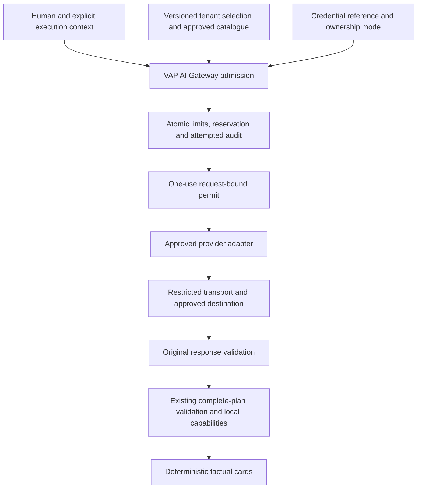

# Phase 7B — VAP AI Gateway and customer-managed model contract

Date: 2026-10-08. Architecture and contract design only. The user identifies the accepted Phase 7 implementation as **Phase 7A**; existing files retain their `phase-7-*` names. No existing acceptance, governing document, activation decision, runtime, migration, credential or account setting is changed by this document.

**Decision:** the accepted foundation can evolve safely through a gateway wrapper, explicit provider adapters and narrowly staged policy/accounting extensions. The security model remains one untrusted intent classification followed by bounded, freshly authorized local reads. The gateway is not a generic inference service, HTTP proxy or workflow executor. Only the first bounded stage may begin after this design; later stages require their stated entry gates and individual review.

## 1. Authority and explicit amendment boundary

Incorporate by reference:

- [Phase 1 capability/security contract](phase-1-capability-contract.md), A1 attribution, SA1 status authority and subsequent signed read/command contracts through Phase 5B. No business authority or fiscal semantics change.
- [Phase 6 foundation](phase-6-read-only-assistant-contract.md), [SDK review](phase-6-laravel-ai-sdk-review.md), implementation/evidence and the accepted search remediation. Preserve all five tools and output minimization.
- [Phase 7 security contract](phase-7-live-inference-security-contract.md), its authoritative [P7-PC1 supplement](phase-7-provider-privacy-decision.md), [implementation](phase-7-implementation-report.md), [remediation](phase-7-remediation-report.md) and their evidence artifacts. Preserve the original-question and FPM/CLI corrections.
- [Production activation decision](phase-7-production-activation-decision.md): Anthropic production remains blocked; its public/account evidence cannot be inherited by OpenAI or a customer endpoint.

**P7B-A1 is a prospective, limited extension** of Phase 7's single-deployment-provider/no-BYOK restriction. It permits design and subsequently reviewed implementation of multiple adapters and two credential-ownership modes. It generalizes profile-bound admission, acknowledgements and accounting as specified below. It does not silently amend the accepted Anthropic wire profile, 552,816 micro-USD reservation, US-only routing, zero tool-result disclosure, one-attempt rule or activation prerequisites. The original documents remain unchanged and govern the legacy path. Where a later adapter needs different wire semantics, its separately reviewed profile must identify those differences explicitly.

Not authorized: live calls, funding, credential creation, provider setting changes, billing implementation, unrestricted models, private-network endpoints, provider failover, result synthesis, new tools, writes/fiscal actions, external API activation or Phase 8. Product configuration mutations in later 7B stages are narrowly scoped AI administration, not assistant business-write authority.

## 2. Repository evidence and preservation baseline

Installed source confirms Laravel **13.24.0** and `laravel/ai` **0.11.2**. `composer show` verified these versions. Boost `search-docs` is unavailable; installed source and current official references were used. `.ai/rules` is absent. The AI SDK and Laravel architecture/security guidance were read; their generic retry/ambient-context patterns do not override the signed one-attempt, explicit-context contract.

| Actual implementation inspected                                                                 | Consequence for this design                                                                                                                                                                                                                                    |
| ----------------------------------------------------------------------------------------------- | -------------------------------------------------------------------------------------------------------------------------------------------------------------------------------------------------------------------------------------------------------------- |
| `AssistantInteraction`, `AssistantPlanner`, `AssistantInteractionContext`, `ExecutionContext`   | Preserve planner port, explicit route workspace/entity/production binding, original membership/permission ceiling, fresh authority and final all-or-nothing disclosure. No provider may select context.                                                        |
| `AssistantInput`, `AssistantDisclosure`, `ProviderIntentInput`                                  | Preserve exact original-question validation, detector policy and per-interaction aliases; no enrichment from stored records.                                                                                                                                   |
| `AnthropicIntentPlanner`, `AssistantIntentGateway`                                              | Current planner owns gating/secret resolution; private gateway owns SDK construction, original-response validation and finalization. Wrap first, extract responsibilities only in reviewed stages.                                                             |
| `AssistantProviderInvocation`, `AssistantProviderPermit`                                        | Identity-bound, fiber-bound, nonserializable, one-use permit and final pre-transmission recheck are reusable principles. Add immutable selection/version binding when selection becomes variable.                                                              |
| `AssistantProviderTransport`, `AssistantProviderResponseBuffer`                                 | Preserve public-address validation, bounded trusted CLI DNS process, pinned socket address, TLS/SNI, prerequisite callback, no proxy/redirect/reuse/retry and read-time byte limits. Generalizing constants requires renewed transport evidence.               |
| `AssistantProviderProfile`, `AssistantProviderResponse`                                         | Anthropic model, geography, usage fields and price arithmetic are provider-specific. Do not move these constants into universal defaults.                                                                                                                      |
| `AssistantProviderLedger` and `2026_10_08_183139_create_assistant_provider_metadata_tables.php` | Five existing tables, primary reads, fixed lock order, atomic audit/reservation, retained liability and one-way finalization. SQL currently fixes reserve to 552816 and bounds to the Anthropic envelope: generic admission cannot merely bypass this check.   |
| `AppServiceProvider`, `config/ai.php`, Composer discovery exclusion                             | Global SDK manager remains blocked; no general SDK provider registration. Only reviewed private adapter seams are allowed.                                                                                                                                     |
| `AgtConnection` and installed `Illuminate\Encryption`                                           | Existing hidden encrypted casts establish local convention. Framework supports authenticated CBC/GCM and prior keys, but ordinary casts do not bind ciphertext to a tenant/row or isolate secrets from the general APP_KEY. AGT behavior remains untouched.    |
| Installed OpenAI `BuildsTextRequests`                                                           | Uses Responses; defaults to storage unless configured stateless; may add encrypted reasoning continuation content. Neither default is acceptable for the proposed closed adapter.                                                                              |
| Existing provider contract/protocol/execution/CLI and PostgreSQL tests                          | Cover final affordable reservation, duplicate admission/finalization, worker death, primary revocation, key rotation, raw JSON, real offline CLI probing and original-text normalization. Extend these oracles; do not replace them with SDK happy-path fakes. |

The working tree already contains extensive earlier-phase work. It is the reviewed baseline, not a clean branch. This design must not reformat, revert or absorb unrelated changes.

## 3. Architecture, modes and authority intersection

The stable application entry is `AssistantPlanner::plan(..., AssistantProviderInvocation)`. A proposed `GatewayAssistantPlanner` implements that port and invokes the **VAP AI Gateway**. Future callers cannot obtain generic SDK objects or transport handles. Keep new backend types near existing `App\Fiscal` assistant services; no new top-level engine is justified.

Effective authority is the intersection of fresh principal authority, original permission ceiling, workspace/entity/production context, tenant enablement, subscription entitlement where applicable, capability subset, selected approved profile, ownership/account binding, active credential, destination policy, current acknowledgement, deployment/provider/model controls, budget and execution limits. A key, model scope or paid subscription alone grants no application authority.

**Mode Disabled:** zero inference. Ordinary UI remains available; no guessed local plan or automatic provider alternative.

**Mode VAP Managed:** VAP owns account, credentials, payer, model policy, activation and operations. Reserve monetary liability against the stable VAP provider-account budget and aggregate deployment/tenant/user budgets. Attribute each attempt to the original tenant. Tenants may select only offered profiles and reduce limits; they cannot choose a secret, change the payer, broaden geography or exceed an entitlement.

**Mode Customer Managed:** a connection belongs to exactly one workspace (tenant), with explicit deployment-environment and legal-entity grants. Customer owns the provider billing relationship; VAP still controls storage, transport and application security. No fallback to VAP credentials, even when customer credit is exhausted. VAP does not reimburse/provider-fund BYOK calls. Customer contract/attestation and provider-project evidence establish payer ownership; a string that looks like a key cannot prove it. VAP infrastructure costs remain VAP's concern; “customer paid” does not exempt local quotas.

Use the existing explicit legal-entity/AGT-production context; never infer it from the credential or browser's current workspace. Tenant settings are shared only across explicitly admitted legal entities. Provider deployment environment (development/rehearsal/production) is a separate axis from AGT environment. This increment grants no homologation assistant access or background/agent principal. Test environments use synthetic context and inert secrets.

## 4. Conceptual contracts and selection lifetime

Names below are proposed application types, not implemented APIs. Every DTO is closed, immutable and typed; no arbitrary options/JSON bags, URL strings, PHP class names, model names or headers are accepted from an inference caller.

| Contract                            | Responsibility and forbidden authority                                                                                                                                                       |
| ----------------------------------- | -------------------------------------------------------------------------------------------------------------------------------------------------------------------------------------------- |
| `AiProvider`                        | Code-registered adapter identifier/version and supported protocol family; never a tenant-supplied driver class.                                                                              |
| `AiModel` / `AiModelProfile`        | Exact approved request/response model IDs, protocol/schema, limits, price/privacy/endpoint versions and expiry. No rolling aliases or runtime models discovery.                              |
| `AiCredential` / `AiSecretResolver` | Opaque connection/version reference, owner mode, tenant grant, payer account identity, expiry/revocation. Secret access only inside the admitted transport path; no serialization/debugging. |
| `AiProviderPolicy`                  | Technical status, production approval, allowed modes/capabilities, privacy/account evidence, revocable revision. Cannot mint business permissions.                                           |
| `AiEndpointPolicy`                  | Exact approved scheme/host/port/path/method, address policy, deployment and owner binding, revision/expiry. Not a general base URL.                                                          |
| `AiBudgetPolicy`                    | Independent local usage ceilings and conservative monetary reservation policy where priced; stable budget identities, integer currency arithmetic and freshness.                             |
| `AiInferenceRequest`                | In-memory validated `ProviderIntentInput`, schema and immutable selection; authority/credential metadata separate from model content. No tool results/history.                               |
| `AiTransport`                       | One bounded exchange using an internal permit and secret, exact approved destination and wire body. Not accessible as a controller/service HTTP utility.                                     |
| `AiInferenceResponse`               | Validated untrusted plan plus closed usage/outcome metadata. No raw response/prose escapes the adapter.                                                                                      |
| `AiUsage`                           | Provider-reported nullable bounded counters, known/unknown/anomalous quality and profile-specific cost estimate; no authority or refund instruction.                                         |
| `VapAiGateway`                      | Resolve/admit one selection, coordinate permit/accounting/audit, choose exactly one allowlisted adapter and return a local plan through the existing planner port.                           |

Resolve selection once from primary state: mode, tenant settings revision, explicit entity grant, provider/model/profile, endpoint approval, credential version, payer budget, privacy/disclosure version, entitlement revision and deployment controls. Bind that tuple and final wire-body digest to the permit. Digest is request-local, never stored as a prompt hash. Re-read authority and revisions at admission, immediately before network transmission, after response, before each local tool and before final disclosure.

Any material change after selection invalidates the request; **do not silently re-resolve to another model, credential, payer, endpoint or policy**. Deny/retry only through a new human submission and ordinary quotas. Permission gain cannot expand the initial tool subset. Disablement/revocation committed before the final prerequisite check must prevent sending. A change after that linearization point cannot retract transmitted bytes; later tools/disclosure still deny. Never hold a database lock over HTTP.

## 5. Common hard execution limits

Keep the Phase 6/7 baseline as gateway ceilings, with profiles allowed to be stricter:

- Original body 12 KiB; question 2,000 characters/8 KiB; validate original text before normalization. Keep `p7-question-v1`, admitted alias policy and zero retrieved-data input.
- One planner/one inference attempt per interaction. Zero retries, repair calls, remote token counting, metadata/model enumeration, tools, continuation, caching requests, streaming, batch or fallback.
- Final body at most 16 KiB; initially retain the conservative byte admission estimate `bytes + 1024 <= 8192` across adapters as an application admission proxy, never a certified tokenizer. Different framing must fit, not raise the ceiling.
- Output maximum 1,024 tokens, selected plan at most 4 KiB, HTTP response at most 64 KiB and headers 16 KiB, enforced during reading. Reject decompression, malformed length or truncated transfer.
- DNS/probe at most one second, connection phase at most two seconds including DNS, transport at most eight seconds and below the remaining planner/interaction budget. Planner below ten seconds, interaction below thirty. Cancel the socket, resolver process and subsequent reads on expiry/disconnect.
- Existing six/user/minute, 120/user/day, thirty/workspace/minute, nonce, lease and downstream billing limits remain provider/mode independent. Four sequential local reads maximum; search 10,000 plus detection key, billing 100,000 plus detection key, exact output caps unchanged.

All limits are application-enforced. A compatible server's token limit or a model's schema claim cannot replace them. Original-response validation precedes any SDK normalization, null-default usage conversion, alias translation or local business read.

## 6. Initial adapter contracts

### 6.1 Anthropic: preserve the accepted implementation

Use `AnthropicIntentPlanner` and `AssistantIntentGateway` behind the new façade first. Preserve exact Messages URL/version, pinned Haiku ID, native schema, disabled thinking, low effort, US inference, current raw-envelope allowlist, nonzero-cache rejection and standard-tier checks. Preserve protected static-file credentials for VAP-managed legacy operation. Do not replace its working cURL transport with the SDK's default client.

After wrapper equivalence is proven, extract application admission/ledger orchestration only as needed. Legacy profile retains `p7-anthropic-haiku55-us-2026-10-08-v1`, expiry, rates, reserve and budget identities. Customer-managed Anthropic needs its own approved account/workspace/secret binding and disclosure even if it uses identical wire bytes. Existing vapsolucoes evidence is not customer-account evidence.

### 6.2 OpenAI: separate protocol, not a renamed Anthropic driver

Design the official OpenAI adapter around one stateless **Responses** request. The installed SDK builder confirms `text.format`, `max_output_tokens` and `store`; a private closed builder is required to force `store=false`, prohibit continuation/reasoning-content inclusion and prevent generic provider-option overrides. Bearer authentication replaces `x-api-key`; no Anthropic version header or `inference_geo` field. Approved project/organization headers, if needed, are bounded operator-owned account metadata, never tenant request headers.

Public documentation confirms structured-output refusal/incomplete paths and a schema subset requiring all object fields to be required; nullable values can represent absence. Do not send the Anthropic optional-field schema unchanged. [OpenAI structured outputs](https://developers.openai.com/api/docs/guides/structured-outputs).

The provider-only OpenAI plan is an object with exactly required `decision`, `reason`, `calls`. `reason` is a permitted reason or null; `calls` is a call array or null. For `read`, require `reason=null` and 1–4 valid calls; for clarify/unsupported, require `calls=null` and the appropriate reason. Each call is a nested closed union of allowed tool/argument shapes. Detail uses only `ref`; search requires `q` and `status`; month requires `month`. No provider-only optional values are stripped until original bytes pass duplicate-key, type, nullability and decision-consistency checks. Then translate the two sanctioned null absences to the unchanged local plan shape. No coercion, fence repair or inferred arguments. Anthropic's schema remains unchanged.

A model profile must pin exact Responses envelope fields, accepted model IDs and exactly one completed assistant output-text item; reject refusal, incomplete/failed status, extra tool/reasoning/message items and unsolicited fields outside the versioned envelope. Input/output/cached/reasoning usage categories are independent: never sum a reported subset twice or assume missing equals zero. Standard-tier, non-reasoning operation with no requested cache is the initial target. If no selected model can satisfy that profile, stop before that adapter stage; this document does not grant hidden-reasoning or cache-retention exceptions.

`store=false` does not remove abuse monitoring or model-specific caching. Storage and inference geography depend on project, model and endpoint; a regional storage choice is not automatically regional inference. Public data controls must be paired with actual account evidence. [OpenAI data controls](https://developers.openai.com/api/docs/guides/your-data). No OpenAI model/price/account is approved here. Seal an exact model/endpoint/privacy/price dossier before 7B.4 implementation; no guessed cost or reuse of the Anthropic reserve.

Provider HTTP 429/5xx/auth/billing errors become fixed local unavailable/circuit categories. No provider message, rate-limit reset header, request ID or exception chain is returned or logged. Local quota exhaustion remains distinct 429; upstream errors remain generic 503. Request/response and usage fixtures must match the selected profile; accepted Anthropic tests do not certify OpenAI.

### 6.3 Approved compatible/self-hosted endpoints

Compatibility is a reviewed deployment profile, not “accepts OpenAI JSON.” Initial wire family is one `POST /v1/chat/completions` with Bearer authentication, `stream=false`, `n=1`, native `response_format` JSON schema, one system and one user message, and the profile's single output-cap field. Reuse the strict nullable provider-plan shape above and unchanged local validator. Require one assistant text choice, terminal stop and no tool calls, reasoning, audio or extra choices. Model deployment artifact/version and response ID allowlist are operator-pinned; a mutable friendly model name alone is insufficient.

Each endpoint needs an evidence dossier for exact dialect, body/envelope, limits, TLS, supported schema, optional usage behavior, retention, logging, geography, billing and operating authority. Unsupported dialects deny; no automatic Responses/Chat switch, models-list probe or retry. No dependency on Ollama/vLLM or permission to use their local default URLs. Customer-managed only initially; VAP-funded compatible hosting would need its own commercial profile.

A profile may explicitly support absent usage for self-hosted serving: record unknown, consume full local attempt/output-envelope units, return only a fully validated plan and never infer zero cost. Missing required usage for Anthropic/OpenAI remains a protocol failure/circuit event. Forged/malformed usage cannot increase limits. Self-hosted pricing can be `not_applicable` for local monetary controls, never a fictional zero-dollar model; request/token-envelope ceilings remain mandatory.

## 7. Endpoint registration and SSRF boundary

Tenants select an approval ID. They cannot supply a URL, DNS/IP override, arbitrary header, proxy, certificate exception, path or port to an inference or connection-test request. Endpoint proposals are inert text until independent VAP security review; saving/editing them causes no DNS lookup or fetch. Approval creation is operator-only and metadata-audited. No automatic ACME, ownership verification callback or endpoint discovery is introduced.

Approved identity is immutable: ASCII DNS hostname (international domains must be reviewed in their canonical A-label form), HTTPS, port 443, exact path/method, provider/profile and deployment; owner scope is either VAP or one tenant. Reject userinfo, queries/fragments, trailing-dot/encoding ambiguity, percent-encoded host/path tricks, backslashes, IP literals, alternate numeric IPv4, zone IDs, Unix sockets and any non-HTTPS scheme. Store canonical fields separately; never concatenate user URL fragments at send time. No wildcard hosts or arbitrary public HTTPS destinations.

At every send resolve **only** that approved hostname through the bounded trusted resolver, validate all A/AAAA answers and bounded aliases, and reject the entire result if any address is non-public or forbidden. Keep the existing maximum 16 addresses/4-KiB resolver output; cap alias depth at 8 with loop detection. Deny loopback, RFC1918, IPv6 ULA/link-local, mapped/translated nonpublic addresses, CGNAT, multicast, unspecified, documentation/reserved ranges, cloud metadata destinations and operator-maintained VAP infrastructure ranges, including public VAP-owned infrastructure. Do not rely on RFC1918 filtering alone.

Resolve once per attempt and pin one validated IP to the connection while retaining the approved hostname for Host/SNI/certificate validation. Verify the actual peer and port before transmission. Do not allow a second resolver lookup, alternate-address retry, connection pool reuse or DNS failure fallback. Public address changes within the approved hostname remain subject to every-send validation; a hostname/ownership/certificate anomaly suspends approval. Operator-defined narrower CIDR restrictions may only reduce allowed addresses. Endpoint ownership/approval expires; it must be reverified rather than treating a once-owned domain as permanently trusted.

Reject all redirects, including same-host redirects. Disable ambient proxy/environment discovery and cookies. Verify certificate chain, hostname and TLS >=1.2; no self-signed/insecure exception in this architecture. Private enterprise networking requires a separate architecture, not a Boolean allowing private addresses. Deploy network egress restrictions independently of application checks, with no body/auth logging. OWASP recommends defense in depth, allowlists, address validation and redirect restrictions; the exact policy here is deliberately stricter. [OWASP SSRF guidance](https://cheatsheetseries.owasp.org/cheatsheets/Server_Side_Request_Forgery_Prevention_Cheat_Sheet.html).

The accepted Anthropic transport stays unchanged through wrapper stage. DNS alias/address-policy generalization must retain its FPM CLI fix and earn new real socket/resolver adversarial evidence before customer destinations are supported. Runtime endpoint testing must never be the mechanism by which an unapproved destination becomes reachable.

## 8. Credential storage, lifecycle and management authority

Separate **provider credentials** (outbound authentication) from existing integration credentials (inbound machine identity). Do not reuse the inbound hashed token table; a provider secret must be recoverable for authentication. No browser receives a stored secret, even once after submission. Credential creation returns an opaque public connection/version ID and fixed status, not the submitted value, suffix, fingerprint or provider response.

VAP-managed credentials remain protected deployment secret references. Customer credentials are encrypted at rest under a **dedicated envelope-encryption key hierarchy**, not ordinary APP_KEY casts. Use a fresh 256-bit data-encryption key per credential version and authenticated AES-256-GCM; wrap it under a versioned dedicated KEK. The authenticated plaintext envelope includes schema, workspace, connection/version, provider, endpoint approval and deployment identity. After decrypting, compare every binding to independently resolved expected context; reject swapped whole ciphertext/wrapped-key pairs. Never serialize PHP objects in ciphertext.

Laravel's installed Encrypter can provide authenticated GCM with explicit keys, but does not itself supply tenant-bound AAD or a KMS. Use a narrow secret-store interface, explicit context validation and protected dedicated KEK resolver; never transparently decrypt through general Eloquent accessors. A protected deployment file using the accepted no-symlink/permissions/inode checks is the bounded initial KEK backend. External KMS/HSM envelope wrapping is recommended for production separation of duties; choosing one requires a later deployment integration review, not a new dependency in 7B.1. Either backend needs proven backup/rotation/access controls before customer secrets are accepted in production. Plaintext, APP_KEY-only encryption or a fake production vault is not a fallback.

Initial input format is a bounded opaque single-line token; profile-specific validation, maximum 512 ASCII bytes and no controls/CRLF. Legacy Anthropic minimum/alphabet remains unchanged. Broader authentication methods require profile review. No tenant-provided authorization scheme, signing code, custom headers, mTLS key upload or OAuth exchange.

Management requires explicit route workspace, active owner membership, verified email, MFA, fresh work session, CSRF, recent reauthentication and no impersonation/delegation/automation. Initial tenant role is **owner only**, deliberately narrower than generic administrator. Owner reauthentication expires after five minutes for add/replace/select/enable/test; emergency disable/revoke still requires fresh authenticated owner/MFA but must not be impeded by expired commercial approval. VAP support cannot impersonate an owner to configure AI. Separate trusted platform-operator authority manages provider/endpoint approval; workspace ownership cannot grant that role.

Connection stable ID and version UUID never change ownership. A customer connection is usable only through one tenant and explicitly granted entities/deployment; even identical plaintext supplied to another workspace must create an independent connection/approval with no shared authorization. Reject known VAP credential reuse in customer mode using restricted secret-store comparison/approved account evidence; never promise an API-key string reveals its payer. An operator cannot convert VAP-paid material into a BYOK grant through a mode flag.

Replacement creates a new immutable version; atomic compare-and-swap selection plus required audit switches the active version and revokes the old local version. Existing permits become stale; there is no silent key retry. Provider-side revocation of an old customer key remains the customer's responsibility through the provider Console; local revoke immediately stops VAP use but does not claim global upstream invalidation. KEK rewrap changes wrapping metadata only, preserves credential identity and budgets, and is audited; changing the secret is a new credential version.

Secrets never enter logs, tracing, debug dumps, validation redirects/session old-input, Inertia props, audit, queues, URLs, metrics, exception chains, SDK events or model text. Mark sensitive parameters, disable body capture at application/proxy/APM boundaries and use explicit allowlisted resources. Keep plaintext only for the current exchange; unset promptly, without claiming guaranteed PHP memory erasure. Authentication failure returns fixed unavailable; rate-limited owner status may say verification failed, never reveal raw upstream messages.

Revocation/deletion: first disable, then tombstone, then destroy encrypted secret/wrapped DEK under approved retention; no deleting attempt liability or immutable creator snapshots. Backups cannot restore live authority without reconciliation. A security incident kills the connection/provider as appropriate, revokes upstream via the responsible owner, reviews metadata, involves privacy operations and requires reapproval. Last-used is a bounded transmission-attempt timestamp, not proof of provider receipt; last-tested stores only fixed outcome/time/profile version.

### Connection test contract

“Test connection” is a separately authorized consequential transmission, never automatic on save. It uses a dedicated internal probe permit for one fixed synthetic classification payload, with no user prose, references or business data and **zero local tool execution**. The configuration action cannot submit an arbitrary prompt. Require endpoint approval, owner authority, profile/account test approval, disclosure of possible provider charge and the same TLS/limits/accounting/redaction gates. Tenant inference can remain disabled while a narrowly scoped rehearsal/test approval is active; no other approval is bypassed.

Cap at one active test/connection, one test/minute/connection and five/hour/workspace in addition to shared actor/workspace usage ceilings; replacement does not reset workspace/actor quotas. Reserve the full applicable amount before sending. Test success proves only the bounded protocol interaction, not privacy approval, entitlement to all models or future availability. No remote models/usage/account discovery. Tests are designed here, not executed.

## 9. SDK-first implementation policy

**Rely on Laravel's AI SDK for provider protocol integration. Do not build a competing provider SDK.** This is also the user's explicit clarification during design. The application-owned gateway supplies policy/authority, not another generic model client.

Use the installed `StepTextGateway::generateTextStep` implementations: `AnthropicGateway`, `OpenAiGateway` and `OpenAiCompatibleGateway`, privately constructed per admitted request. The compatible gateway already builds Chat Completions/native schema; reuse it. Override only the narrowly reviewed request options/client seam needed for exact profile bytes, isolated bounded transport and original-response validation. Generic SDK clients/events never receive usable ambient credentials. No vendor edits or version upgrades in the first stages. [Laravel AI SDK](https://laravel.com/framework/docs/13.x/ai-sdk).

| SDK owns/reuses                                                                                                             | Facturac must own                                                                                                                                                                                                                 |
| --------------------------------------------------------------------------------------------------------------------------- | --------------------------------------------------------------------------------------------------------------------------------------------------------------------------------------------------------------------------------- |
| Provider-specific protocol builders, message/schema representations, single-step invocation and compatible-provider support | Tenant/actor/context authority; approved selection; secret resolution; disclosure; atomic budget/audit; destination/TLS/DNS/deadline/byte policy; strict original-envelope validation; local capabilities and deterministic facts |
| Parsing utilities after original validation                                                                                 | Refusal/usage/shape decisions that cannot be delegated to permissive parser defaults                                                                                                                                              |
| Test helpers for supplementary protocol/unit checks                                                                         | Transport-level denial and adversarial evidence; SDK agent fakes are insufficient                                                                                                                                                 |

Do not enable `AiManager`, `Promptable`, tool loops, remembered conversations, automatic provider lists/failover, SDK model defaults, queueing or modalities. A method existing in the SDK is not an approved application capability. If an installed seam cannot enforce a profile, document the specific method/behavior and return to Astra; do not silently replace the SDK with hand-written HTTP/protocol code. Only a reviewed exception may justify a custom protocol adapter. This policy preserves the accepted Anthropic bridge rather than replacing it for stylistic consistency.

## 10. Catalogue, tenant settings and privacy profiles

Use a **code-reviewed, administrator-controlled catalogue** of providers/model profiles. Provider identities map to literal adapter classes in code. Immutable model profile manifests define exact model/response IDs, purpose `assistant_intent`, supported ownership modes, protocol dialect, schema version, token/byte/time maxima, usage fields, price currency/rates/envelope/effective date/expiry, endpoint reference, region controls, training/retention/cache/safety exceptions, agreement/subprocessor references and privacy/disclosure revision. No secrets or arbitrary executable settings. Runtime administrative rows can disable or approve already-reviewed manifests; they cannot upload provider code, type new model IDs into a tenant request or rewrite a manifest.

Provider/model state separates **designed**, **technically verified**, **deprecated**, **disabled** from **production pending/approved/expired/revoked**. An adapter existing in the installed SDK does not mean Facturac has technically verified it. Missing evidence, unknown retention or absent monetary rates are explicit states and deny relevant activation; null is never interpreted as permissive. Deprecation denies new selections; existing operation is allowed only until a separately approved fixed expiry, otherwise deny. Emergency disable overrides all approvals.

A tenant setting selects exactly one mode and model profile at a time; no per-question override. Store stable connection reference only in customer mode; VAP mode resolves a platform-controlled account grant. Capability configuration is a subset of the five tools and intersects current permissions. Settings include bounded usage/monetary ceilings, approved entitlement revision and optimistic revision. Daily/monthly limits are UTC; changing them never erases consumed liability. An owner can lower caps; increases cannot exceed VAP policy/plan. No floating-point prices, SQL predicates or executable expressions in settings.

For each profile/account combination, record separately: training opt-in status; ordinary/abuse/feature retention; ZDR eligible versus actually enabled; storage geography versus inference geography; support/safety/system-data exceptions; applicable terms/DPA/subprocessors; evidence reference, approvers and expiry. Customer ownership does not substitute for VAP privacy review. Self-hosted does not imply local, no logging, no subprocessors or zero retention. Technical availability never implies production approval.

Current status is Anthropic **technically accepted / production pending**; OpenAI and compatible adapters **designed / not yet technically verified / production pending**. Independent approval and separately authorized synthetic rehearsal are required per provider/profile, even if another provider is blocked. Development of a disabled adapter does not require funding or Anthropic activation.

## 11. Durable usage, monetary budgets and entitlements

Keep reserved liability and reported usage separate. Monetary policies use integer micro-units with explicit currency; first implementation admits only **USD** priced profiles to reuse the existing micro-USD ledger safely. Other currencies need a reviewed schema/accounting extension; never convert or aggregate currencies implicitly. Self-hosted unpriced mode has `monetary_applicable=false`, nullable actual cost and positive reserved usage units, not a free-money authorization.

For each priced profile, reserve upward-rounded worst-case input-envelope cost plus full output limit plus every enabled fixed/tier/regional surcharge. Preserve the accepted Anthropic formula and **552,816 micro-USD** exactly. A cheaper model, BYOK mode, key rotation or successful response does not justify releasing that profile's admitted reservation. For new profiles, establish a proven tokenizer bound or use the full supported input envelope at maximum applicable prices; byte estimates alone never justify a monetary maximum. Reject missing/stale/unbounded prices before sending. SDK/provider usage is telemetry, not admission authority.

Every mode reserves durable **attempt units and output-envelope units** against global-user/day, workspace/day/month and deployment/day/month usage ceilings. Keep the existing fast rate/nonce/lease controls as well. Priced customer profiles also reserve their conservative customer-budget estimate where a spend ceiling is offered; label it an application estimate, not control over other uses of the customer's provider account. Unknown external billing terms must disable the monetary-cap promise, not silently assign zero. VAP-managed traffic always requires both usage and monetary budgets.

Stable identities are independent of credential version, selected model, plan subscription version and provider switch:

- Global application user and tenant usage identities span all providers/modes, and all legal entities in the workspace.
- VAP aggregate monetary identities span VAP-managed providers; provider-account identities separately constrain each actual paying account.
- Customer monetary identity is tenant-owned and spans that tenant's priced connections; each customer account has an additional stable partition. No charge enters VAP's provider-payable ledger in customer mode, but it still consumes shared infrastructure usage.
- Development/rehearsal/production sharing an actual paying account must share a ledger or approved non-overlapping account allocations. Adding a budget identity is an operator action, never automatic on a key/model change.

Atomic transaction: lock root deployment admission control, then applicable provider/model/account controls in sorted stable-ID order, settings/connection/approval rows in fixed table/key order, and budget windows in canonical `(budget identity, scope rank, scope key, UTC start)` order. Use the same order for finalization, revocation and recovery; no HTTP while locked. Safely create unique windows, validate all current ceilings with overflow-safe subtraction, reserve all usage/money allocations, insert the unique attempt and required attempted audit, then commit or roll back entirely. Zero/default/missing limits deny. Control root is an intentional correctness-first serialization point; do not optimize it away without concurrency evidence.

For legacy-only stages retain the current lock order unchanged. Generalized multi-budget stages acquire the new root before existing control/window locks and explicitly test old/new paths racing against the same legacy budget. Persist each attempt's allocation identities/window starts so finalization/recovery never re-resolves current tenant settings. Midnight/month rollover keeps original admission windows. Conditional terminal transitions make duplicate finalization harmless. Failure after attempted commit retains full reservation, including not-sent; crash/unknown delivery never resends. Restore/cache loss cannot replenish active liability; deny pending reconciliation.

Provider-reported input/output and explicit subcategories must be bounded integers with profile-defined relationships; missing optional usage is null/unknown only where approved. Negative, fractional, overflow, inconsistent totals or novel billable categories fail validation. Circuit an affected connection/account/profile according to origin; a malicious tenant endpoint cannot automatically disable unrelated providers, while platform-wide anomalies remain operator-escalated. Never refund based on a claimed zero usage or a malicious response.

Paid subscriptions are an **entitlement input**, not implemented billing: included attempts, bundles, premium access and hard caps can map to a versioned grant. Reserve usage units atomically with attempts; expiration/downgrade revalidates before send. Administrative credit would be an append-only authorized grant, never counter decrement; this phase implements neither purchase, invoice, auto-top-up nor credit UI. Entitlements cannot buy additional fiscal authority or bypass privacy.

## 12. Minimum persistence proposal and migration safeguards

No migrations are created by this design. Prefer extending the five existing metadata tables; do not create parallel usage-event/reservation engines. Provider/model catalogue definitions remain versioned code manifests. Proposed new tables are limited to the following responsibilities:

| Proposed table                   | Ownership, keys and constraints                                                                                                                                                                                                                                                                                                                                                                                                                                        |
| -------------------------------- | ---------------------------------------------------------------------------------------------------------------------------------------------------------------------------------------------------------------------------------------------------------------------------------------------------------------------------------------------------------------------------------------------------------------------------------------------------------------------- |
| `ai_gateway_controls`            | Deployment identity + closed kind `global/provider/model`, non-null controlled subject key; unique triple, revision, enabled=false, circuit flag, fixed outcome, bounded approval reference/expiry. Provider/model subjects must match a code manifest. No URL/secret or generic settings map.                                                                                                                                                                         |
| `ai_model_profiles`              | Immutable profile ID/version and unique manifest digest; typed provider/model/endpoint/price/privacy/disclosure identities and approved numeric envelope bounds, USD-or-unpriced discriminator. Materialized only from reviewed code for DB references/constraints, not editable policy JSON. Runtime activation lives in controls.                                                                                                                                    |
| `tenant_ai_settings`             | One unique workspace row, mode default disabled, revision, selected profile, optional customer connection/version, bounded ceilings and immutable creator A1 snapshot. Composite references enforce customer credential workspace ownership. Current owner approval required; selection change is audited compare-and-swap.                                                                                                                                            |
| `tenant_ai_credentials`          | Stable connection UUID + immutable version UUID; workspace, deployment, provider, endpoint/profile-family and payer-budget binding; ciphertext, wrapped DEK, KEK version, encryption schema, creator A1, optional current creator FK, expires/revoked/last-used/test metadata. Unique `(connection_id, version)` and `(workspace_id, version_id)`; one active selected version through settings and a partial uniqueness guard. No plaintext/default decrypt accessor. |
| `ai_endpoint_approvals`          | UUID/version; closed ownership kind and non-null owner key, exact canonical destination fields, protocol, deployment, expiry, approver snapshot, evidence reference, revision/status. Immutable destination identity; replacement creates a new approval. Scope checks prevent another tenant using an approval.                                                                                                                                                       |
| `assistant_provider_allocations` | Junction from immutable attempt UUID to existing budget window ID; reserved amount/usage units and accounting role. Unique `(attempt_id, window_id)`; restrict-delete FKs; immutable after admission. Required because a generalized attempt can charge several budget identities. No result data.                                                                                                                                                                     |

Extend existing tables only in the reviewed persistence stage:

- `assistant_provider_controls`: retain old budget IDs and controls; add immutable payer/ownership/provider-account metadata and revisions for new policy-aware operation. Never repurpose an existing account identity. Root aggregate budgets can use explicit non-provider payer scopes, not fabricated accounts.
- `assistant_provider_windows`: retain all counters and unique identity; add nonnegative monotonic reserved usage/output-envelope units. All new window kinds are closed enums with canonical non-null scope keys and UTC bounds. Preserve every old window, aggregate, FK and anti-decrement trigger.
- `assistant_provider_attempts`: retain unique interaction UUID, states and immutable legacy columns; add version/discriminator, provider/mode, credential-version or protected VAP reference ID, endpoint/profile/selection/disclosure/entitlement revisions, `purpose=assistant_intent/connection_probe`, nullable monetary applicability and approved counters. No prompt, plan, secret, raw error or arbitrary JSON.
- `assistant_provider_tenants`: continue as immutable owner approvals; new version adds exact legal-entity/production context, profile/account/selection/disclosure binding. Composite entity/workspace FK; one active approval per context/version. Old approvals are legacy-only and never authorize another provider or customer mode.
- `assistant_provider_acknowledgements`: add new disclosure identity binding for new rows; preserve legacy uniqueness/behavior for legacy rows. New uniqueness is actor A1 + workspace + effective disclosure identity. Do not backfill consent from old acknowledgement.

**Database guards are part of the migration contract.** Preserve exact legacy reserve/bytes/token checks under `contract_version=legacy` (existing rows). A reviewed new-version branch must verify the inserted attempt's reserve, limits and profile binding against the immutable materialized profile and allocations; cross-table validation requires trigger/FK design, not a permissive `CHECK(reserve >= 0)`. New-versus-legacy discriminator cannot be rewritten. Validate allocation sums/roles atomically before an attempt becomes admitted; direct SQL must not manufacture an executable zero-reserve priced attempt. Profile/tenant/credential/endpoint tuple FKs or equivalent insert/update guards enforce ownership even when bypassing Eloquent. Application checks remain mandatory too.

Indexes: unique selection/credential/approval identities above; `(workspace_id, deployment, revoked_at, expires_at)` for credential admission; attempts `(workspace_id, admitted_at, id)` for bounded owner history and existing `(state, admitted_at, id)` recovery; allocation unique key plus window FK lookup; controls primary unique subject key; acknowledgements exact identity. Owner usage reads must use fixed windows/pagination, not unbounded financial scans. No new fiscal indexes/schema.

Migration procedure: disable gateway, inspect populated legacy tables, add nullable/new-version columns and new tables, preserve legacy discriminator defaults and original IDs, populate only immutable profile definitions, validate constraints, then deploy separately reviewed code. **No automatic tenant enablement, new acknowledgement, decrypted-secret import or conversion to customer mode.** An explicit controlled reconciliation can derive allocations for old rows without altering totals; until completed, keep them on the legacy finalizer/recovery path. Do not double-charge old windows. New generalized execution is blocked until the applicable old-liability reconciliation is verified.

SQLite preserves fast checks with equivalent triggers; PostgreSQL is mandatory for constraints, locking, backfill and concurrency. Production DDL strategy/locking and backup verification are operator gates. A down migration must refuse destructive downgrade when new-version attempts/credentials exist; safe rollback disables new traffic and runs compatible recovery, rather than dropping liability. User removal may null a creator FK, never the copied A1 identity. Workspace/entity/account/profile deletion is restricted while retained records/liability refer to it. Credential secret destruction retains tombstones/attribution; purge only expired, resolved metadata under an approved policy, never active windows.

## 13. Disclosure, audit, observability and kill switches

Acknowledgement identity is **actor A1 + tenant + effective disclosure version**. Effective version binds provider, ownership mode, external processing operator/account class, endpoint approval identity, input policy, retention, storage/inference geography and material privacy version. A new provider/mode/endpoint/privacy posture requires new tenant approval and user acknowledgement. A secret rotation within the same approved account/profile does not itself change disclosure, but invalidates in-flight credential selection. Model changes require a new technical selection revision; acknowledgement changes if processing behavior/terms differ. Re-enabling after withdrawal requires an explicit new acknowledgement, never historical row inference.

Explain VAP-managed external processing versus customer-selected external processing accurately. BYOK does not mean local processing. Keep product acknowledgement separate from legal consent/contract execution; a tenant owner cannot consent for every data subject. No claims of anonymity, perfect filtering or blanket ZDR. Notice must precede transmission and identify actual provider/mode and residual sensitive-prose risk. No permission to send tool results is implied.

Retain `assistant.provider.attempted/received/failed/blocked/quota_rejected` and existing interaction/tool/privacy events. Add a versioned closed metadata extension for provider ID, exact profile/model version, ownership mode, selection revision, connection version ID, endpoint approval ID and price/privacy version. These IDs are local audit metadata, never sent in model content. Trusted actor/context/correlation, outcome, bounded latency, reserved liability and validated nullable usage remain allowed. Connection-test events carry a server-generated operation ID and `purpose=connection_probe`, never fabricated tool execution. Attempted means intent to send, not delivery; received is not a validated factual answer.

Configuration/credential/endpoint approval/rotation/revocation/kill events are required in the same transaction as their change. Store only public opaque IDs, actor snapshots, version transitions and fixed reason codes, never credential fragments or free-form admin notes. Audit failure prevents activation/reservation/send; received/finalization audit failure prevents tools/disclosure and retains liability. Recovery is bounded, idempotent and does not infer receipt.

Metrics: controlled provider/model/outcome counts, latency buckets, timeouts, denied requests, reserved/unknown usage, endpoint-validation categories and kill status. No tenant labels in broad metrics, URL/error strings, raw User-Agent/headers, prompt/plan/result data or provider request IDs. Tenant usage belongs in scoped owner views; operators may inspect restricted attribution with existing audit permission. Instrumentation must be tested across SDK, cURL, Laravel, proxy/APM, worker/recovery and validation errors.

Layered denial is an OR across global deployment, provider, model/profile, tenant, credential version and endpoint controls; missing/unreachable state denies. Read from primary at the established checkpoints; caches can deny sooner but cannot authorize after stale allow. Disabling a provider/model never picks a replacement. Customer endpoint circuit affects that endpoint/connection; VAP-wide emergency disable blocks both modes. Secret resolution/decryption failure is closed, with no ambient-key fallback. Revocation cannot undo bytes already sent; it blocks subsequent work and new sends.

## 14. Future Settings → AI experience

Design only. Present Disabled / VAP Managed / Customer Managed, current provider/model, production-approval status and fixed explanation for unavailable choices. Select only approved catalogue IDs; endpoint proposal is a separate operator-review request, not a testable URL field. Show existing explicit tenant/entity context and granted entity list before saving.

Owner can disable, choose an offered mode/profile, submit/replace a secret, explicitly test an approved connection, lower limits, view bounded usage/disclosure and revoke. Secret input is empty after submission; never preload or return it. Show fixed connected/unverified/expired/revoked status, last test/attempt time and secret version label only. Use current Inertia/Wayfinder patterns in the future UI stage, CSRF and optimistic revision; two stale tabs must not resurrect a revoked key or overwrite a newer selection. A 409 asks for reload; it never retries automatically.

Saving a key/configuration does not enable inference. Separate clear actions for approval/notice and enablement; unavailable deployment/provider/privacy gates remain visible without sensitive account details. Usage distinguishes retained reservation from estimated reported use and unknown usage, and VAP allowance from customer billing. No purchase, automatic refill, secrets export or provisioning provider accounts. Platform operators have a separate restricted catalogue/status surface; it cannot author arbitrary SDK options or bypass code-profile review.

## 15. Migration map and evidence that must be renewed

| Phase 7A component                                                                                                 | Classification            | Phase 7B destination / proof obligation                                                                                                                                               |
| ------------------------------------------------------------------------------------------------------------------ | ------------------------- | ------------------------------------------------------------------------------------------------------------------------------------------------------------------------------------- |
| `AssistantPlanner` and `AssistantInteraction`                                                                      | PRESERVE AS-IS initially  | Gateway implements existing port; same deterministic outputs/order and final authority. Only later explicit selection context additions, not a new executor.                          |
| `AssistantInput`, `AssistantDisclosure`, `ProviderIntentInput`, `AssistantJson`, `AssistantPlan`, `AssistantTools` | PRESERVE AS-IS            | Original text, permitted DTO, alias/local-plan validation and five tools remain authoritative. Provider-only strict null-shape conversion stays outside these local business schemas. |
| `AnthropicIntentPlanner`                                                                                           | EXTRACT BEHIND INTERFACE  | Wrap first; later move shared admission to gateway while retaining protected legacy secret resolver. Prove same failure/audit/reservation ordering.                                   |
| `AssistantIntentGateway`                                                                                           | PROVIDER-SPECIFIC         | Existing private Anthropic SDK adapter; do not mistake its name for a universal gateway. Rename only if needed in a separately bounded stage.                                         |
| `AssistantProviderTransport`, buffer and CLI probe                                                                 | EXTRACT BEHIND INTERFACE  | Keep original behavior for Anthropic. Parameterization by approved endpoint requires new DNS/socket/TLS/redaction evidence, never request URL injection.                              |
| `AssistantProviderProfile`, response parser                                                                        | PROVIDER-SPECIFIC         | Legacy immutable profile/parser; common catalogue references them. OpenAI/compatible have separate parsers, usage categories and prices.                                              |
| `AssistantProviderInvocation`, permit                                                                              | GENERALIZE                | Bind complete immutable selection and purpose, retain same-object/fiber/digest/one-use/deadline checks; do not expose a forgeable public token.                                       |
| `AssistantProviderLedger` and five tables                                                                          | GENERALIZE                | Preserve legacy liability and append-only transitions; reviewed multi-budget allocations, ownership/privacy revisions and usage ceilings. New PostgreSQL proof required.              |
| `AssistantAudit`, required audit and recovery command                                                              | GENERALIZE narrowly       | Versioned metadata extension; legacy finalization unchanged until migration reconciles. No new content fields or retry jobs.                                                          |
| SDK quarantine, default-disabled config                                                                            | PRESERVE AS-IS            | Narrow symbol/file allowlist can grow only for reviewed SDK adapters. No global manager opening.                                                                                      |
| Existing assistant UI/cards/capabilities                                                                           | PRESERVE AS-IS            | Add mode-specific notice only in UI stage; cards and fiscal meaning do not change.                                                                                                    |
| Single global selection assumption                                                                                 | DEPRECATE after migration | Explicit tenant selection replaces it for new-version requests. Keep a legacy compatibility path with no double execution; removal requires separate evidence.                        |

**REPLACE: none required for accepted transport/business components.** Security evidence is invalidated by new mutable selectors, different SDK body construction, altered cipher/key boundary, broadened DNS destinations, changed database checks or acknowledgement semantics. Each requires the targeted regression matrix below; passing the old Anthropic suite alone cannot approve it.

## 16. Threat model and mandatory adversarial tests

| Threat                                      | Mandatory control                                                                 | Required acceptance evidence                                                                                                                                                                |
| ------------------------------------------- | --------------------------------------------------------------------------------- | ------------------------------------------------------------------------------------------------------------------------------------------------------------------------------------------- |
| Cross-tenant credential/endpoint reference  | Composite tenant ownership checks/FKs, immutable encrypted context, scoped lookup | Swap IDs, ciphertext and complete envelopes across tenants/entities/deployments; direct SQL and HTTP deny before secret use/send.                                                           |
| Secret leakage                              | Restricted resolver, no Eloquent auto-decrypt, explicit resources and redaction   | Sentinel in validation/exception/SDK/proxy/APM/audit/browser/job paths; zero plaintext or secret fragments. Tamper/MAC/unknown KEK failures stay generic.                                   |
| SSRF / generic proxy                        | Registered canonical endpoint, public-address plus VAP-deny policy                | localhost, decimal/hex/octal IPv4, IPv6 mapped/ULA/link-local, metadata, public VAP hosts, credentials-in-URL, scheme/port/path/encoding attacks. Unapproved save/test performs no network. |
| DNS rebinding / mixed records               | All-answer validation, bounded resolver, pinned socket + peer check               | Public then private answer, mixed A/AAAA, alias loop/depth, overlong answers, peer mismatch, slow DNS, changed DNS after validation. No second resolution.                                  |
| Redirect/TLS bypass                         | No redirect/proxy/reuse, chain/name verification                                  | Same/different host redirect, HTTPS→HTTP, invalid certificate/SNI, proxy env contamination; early abort with no second attempt.                                                             |
| Malicious compatible server                 | Streaming read bounds, strict original parser, no execution                       | Slow/chunked/oversized/compressed headers/body, duplicate keys, huge usage, spoofed models/tiers, unsolicited tools/reasoning, invalid schema; no tools/facts on rejection.                 |
| Prompt injection / stored-text exfiltration | Original-question policy; zero tool-result path; complete local plan validation   | Preserve tab/whitespace regressions, escaped identifiers, extra authorities, SQL/URL tools, aliases from another interaction, sentinel additions to every record/card.                      |
| Selection downgrade / provider switch       | Approved immutable versions and fresh intersection                                | Switch provider/model/mode/endpoint/price/credential mid-flight; old permit/notice fails; no fallback or body reinterpretation.                                                             |
| Budget manipulation / forged usage          | Durable reserve, stable cross-provider units, no refunds                          | Final affordable slot raced across providers/modes/keys; zero/negative/missing/overflow/stale prices; provider telemetry cannot grant another request.                                      |
| Disclosure bypass                           | Actor/tenant/effective-disclosure identity                                        | Anthropic acknowledgement used for OpenAI/BYOK/another endpoint; stale UI; withdrawn/recreated membership; no send.                                                                         |
| Compromised credential                      | Local revoke/kill and upstream owner procedure                                    | Revoke before prerequisite check prevents send; revoke during response prevents tools; rotation cannot reuse old permit/reset budgets.                                                      |
| Replay / double finalize                    | Unique interaction/attempt, nonce, immutable allocations                          | Same/different provider replay, duplicate finalize/recovery, process death before/after every commit; no resend/double charge reduction.                                                    |
| Races / transactions                        | Primary reads, common lock order, CAS versions                                    | Disable/admit, rotate/send, cap downgrade/reserve, approval expiry, owner loss, rollback, UTC rollover and migration coexistence; correct linearization documented.                         |
| Automatic failover disclosure               | Exactly one resolved adapter, no SDK failover list                                | Timeout/429/auth/refusal/schema failure never invokes second provider/key/model; local safe failure only.                                                                                   |
| Subscription bypass                         | Server-owned versioned entitlement and immutable consumption                      | Customer/VAP mode switch cannot reset shared quotas; upgrade/downgrade/credit cannot fabricate unconsumed units. No billing path implemented.                                               |
| Lost audit or restored old database         | Atomic mandatory audit, reconciliation gate                                       | Failed attempted/received/config audit prevents respective effect; restore cannot revive revoked authority or erase current liability.                                                      |

Tests must assert absence of transmission/decryption/tool calls at the actual boundary, not only an HTTP status. Use literal wire fixtures through the real adapter serialization; SDK agent fakes alone cannot pass these gates. Local controlled TLS/resolver harnesses may be authorized for implementation tests, with inert credentials and no public provider traffic; production destination validation must not gain a test-mode localhost escape. Dependency injection must be test-process only.

## 17. Implementation stages, acceptance gates and stop points

Every stage is disabled by default, produces exact files/hashes/commands/exits/test counts and stops for review. Tests accompany changes in each stage; 7B.8 is an integrated adversarial review, not a deferral of earlier security tests.

| Stage                                                | Bounded objective                                                                                                                                      | Entry/exit conditions                                                                                                                                                                                                                                                                            |
| ---------------------------------------------------- | ------------------------------------------------------------------------------------------------------------------------------------------------------ | ------------------------------------------------------------------------------------------------------------------------------------------------------------------------------------------------------------------------------------------------------------------------------------------------ |
| **7B.1 Core gateway façade**                         | Existing planner port + provider-independent conceptual interfaces/immutable descriptors needed for wrapper; legacy Anthropic delegation only          | This contract. No schema, credentials, UI, transport rewrite or new provider calls. Differential wire/output/audit/reserve equivalence, deny unknown selections, preserve quarantine. Stop for review.                                                                                           |
| **7B.2 Anthropic migration adapter**                 | SDK-first encapsulation and explicit selection binding for the legacy profile, minimum responsibility extraction                                       | Approved 7B.1. Same exact Anthropic profile, static secret mechanism, ledger and deadlines; no generalized endpoint/secret persistence yet. Independent security review of changed seams.                                                                                                        |
| **7B.3 Catalogue/persistence/credential foundation** | Immutable catalogue records, primary controls, tenant settings, envelope store, multi-budget/approval migrations and probes using synthetic transports | Approved 7B.2 plus Astra-reviewed concrete DDL/lock-order supplement implementing section 12. Catalogue foundation moves ahead of adapters because they need immutable policies/FKs; no management UI or real credential import. PostgreSQL migration/concurrency and encryption tests required. |
| **7B.4 OpenAI SDK adapter**                          | One exact reviewed Responses profile, synthetic protocol fixtures and shared gateway integration                                                       | Exact model/API/endpoint/schema/price/usage dossier reviewed by Astra; this is a technical-profile gate, not a requirement to buy credits. Unsupported features halt; no live request.                                                                                                           |
| **7B.5 Compatible SDK adapter**                      | One reviewed dialect and endpoint-policy path; endpoint approval and SSRF tests                                                                        | Exact test profile and endpoint/transport supplement approved; no arbitrary URL, private networking or production endpoint activation.                                                                                                                                                           |
| **7B.6 Operator catalogue administration**           | Manage existing profile activation/disablement, expiring evidence and endpoint approval records                                                        | Explicit platform-operator authorization integration reviewed before routes; no tenant-admin elevation or free-form profile authoring. Production approvals remain unset.                                                                                                                        |
| **7B.7 Tenant settings UI**                          | Owner-only mode/selection/key replacement/limits/disclosure and explicit synthetic-tested probe flows                                                  | Reviewed backend plus localized disclosure/security UX. No real provisioning/funding/testing/enablement in implementation.                                                                                                                                                                       |
| **7B.8 Integrated adversarial/concurrency gate**     | Cross-adapter policy/ledger/transport/secret/consent proofs and full inherited regressions                                                             | All deterministic matrix cases, independent-process PostgreSQL races and no-network quarantine pass. No weakening/suppressions.                                                                                                                                                                  |
| **7B.9 Independent final review**                    | Astra attempts to falsify ownership, egress, privacy and liability guarantees                                                                          | Approval is technical only. Each provider/account/endpoint still needs separate human/legal/operational activation and authorized rehearsal.                                                                                                                                                     |

Before **any** implementation: accept this gateway architecture and SDK-first boundary; no unresolved technical decision prevents 7B.1. Before later implementation, the named DDL, concrete new-model/dialect and operator-authority supplements are required. Sol may not invent them or interpret a stage table as permission to implement all stages automatically.

Provider-specific production prerequisites remain independent: actual account/payer authority; terms/DPA/subprocessors; approved residual question risk, retention/geography, notice; exact model entitlement/price/limits; secure secret backend; deployment FPM/CLI/TLS/DNS/egress/logging evidence; budgets/entitlement; kill/recovery/backup readiness; synthetic quality/latency rehearsal authorization; named dated owner/security/privacy/operations signoff. None is PASS merely because the architecture or SDK supports it.

### Required validation for later implementation

Run focused provider and contract tests plus complete applicable inherited gates. Record exact commands, exit statuses, counts, runtime versions, PostgreSQL database encoding and fixture transport limitations. Mandatory gates include:

1. Complete SQLite suite and focused Phase 6/7 original-question, audit, quarantine, SDK wire, response and FPM/CLI suites; maintain all earlier Phase 1–5B regressions.
2. PostgreSQL UTF8 integration selection and full concurrency group on disposable `facturac_test_*` databases with `FISCAL_PG_GATE=1`; independent workers with barriers, never sequential SQLite simulations. New schema direct-SQL constraints, populated up/down behavior, legacy liability reconciliation and exact final affordable reservation across providers/modes must pass.
3. Existing bounded customer-search/billing PostgreSQL plan gates where touched; no accidental query widening through configuration or usage UI.
4. Assistant UI tests, type checking, changed-file ESLint/Prettier, PHP syntax, Pint after PHP changes; PHPStan diagnostic-object comparison to the **21 inherited diagnostics**. Record the known **9,719 ESLint errors**, four pre-existing formatting failures and test warning separately; counts alone cannot classify new debt. No test deletion or suppression.
5. Architecture assertions: all inference entry points pass the gateway; SDK import allowlist only reviewed bridges; no generic manager resolution, failover, tools/modalities, remote metadata discovery or new provider network in tests; external API/egress remains off.
6. Security fixtures test exact final body/header bytes and raw responses with sentinel secrets/forbidden data. Compare unchanged legacy profile reserve/expiry and request behavior before/after each migration. Record tests not performed; fake responses never establish actual provider privacy, invoice accuracy or availability.

## 18. Phase 8 relationship and decisions deferred

**NO AUTOMATIC CROSS-PROVIDER FAILOVER.** No failure category authorizes a second provider call.

Phase 8 BYOW must consume a separately authorized gateway purpose, not an SDK/provider directly. It may reuse provider selection/credential/privacy/accounting infrastructure, but cannot use the current first-party `assistant_intent` or probe permit to impersonate a workflow. Workflow principals, approval/delegation, risk tiers, retries/idempotency and any tool-result disclosure require their own contract. No new workflow authority is granted here. The model provider must never decide whether a fiscal action is authorized.

Deferred: automatic failover (even same-provider alternate keys/models), private-network enterprise endpoints, additional currencies, live billing/subscriptions/credits, provider account provisioning, federation, generic model chat, multimodal/RAG/history/streaming, fiscal writes and all Phase 8 work. A future failover policy requires explicit tenant opt-in, equivalent separately approved disclosure/privacy/geography/cost envelopes, new reservation rules and independent review; there is no dormant automatic fallback in 7B.

## 19. Design validation and recommendation

This design was checked against the actual application/SDK builders, authority/permit/transport/ledger, schema guards, encrypted-secret convention and representative adversarial/concurrency tests. Current official Laravel/OpenAI documentation supplements installed source; public claims are not account approvals. The existing Anthropic activation evidence remains unchanged. No actual model, secret, endpoint or subscription was provisioned or exercised.

The fundamental security model survives: application authority and fiscal facts stay deterministic; the SDK supplies protocol mechanics behind policy controls. The important new boundaries—recoverable tenant secrets, approved customer destinations, provider-specific disclosure and multi-budget identity—are explicit rather than delegated to a provider name. A blocked Anthropic procurement gate does not block offline gateway or other-adapter development, and another adapter cannot inherit Anthropic activation.

Documentation validation and unchanged-file checks are recorded below after formatting. Runtime tests are not rerun for a design-only artifact; their implementation gates above remain mandatory. No claim of new runtime compatibility or independent implementation approval is made.

Validation for this design: `npx --no-install prettier --write docs/phase-7b-multi-provider-ai-gateway-contract.md` and the corresponding `--check` passed (exit 0). A Python SHA-256 preservation/link/required-boundary check passed (exit 0): all **1,127** snapshotted pre-existing files remain unchanged, including every accepted governing document and activation decision; all relative document links resolve. Only this new contract was added. Existing npm `user`/`unsafe-perm` configuration warnings are unrelated. No runtime tests, provider calls or account actions were performed for this documentation-only task.

## 20. Exact bounded Sol Medium handoff — 7B.1 only

> Implement **Phase 7B.1 Core Gateway Façade only**, using Sol Medium. Read this entire contract and the governing Phase 6/Phase 7 security/P7-PC1/remediation documents and current accepted implementation before edits. Preserve existing work and signed invariants. This handoff does not authorize stages 7B.2–7B.9.
>
> Introduce the smallest application-owned VAP AI Gateway façade implementing the existing `AssistantPlanner` port. Route its legacy Anthropic path through the existing accepted planner/private Laravel AI SDK bridge. Add only the immutable provider/profile descriptors and interfaces needed for that wrapper; do not build a second SDK, speculative provider engine or unused configurable transport. Keep SDK v0.11.2, global quarantine and existing private single-step behavior. Unknown provider/model/mode/endpoint inputs deny; no tenant selection API or new provider adapter in this stage.
>
> Preserve the exact original-question policy, byte/token/time limits, explicit workspace/entity/production context, five local tools, fresh authority and final disclosure, alias isolation, required audit, ledger identities/states and **552,816 micro-USD** legacy reservation. Preserve disabled defaults, protected static-file credential path, CLI/FPM fix, fixed Anthropic destination and response semantics. No schema, key storage, migration, secret import, provider settings, UI, entitlement/billing, network activation or OpenAI/compatible runtime work is authorized.
>
> Add differential tests proving that the wrapper produces the same actual final request bytes, error/status classes, local plans/cards, audit ordering and budget outcomes as the existing path. Preserve direct-call/CLI/fiber/replay/quarantine denials and every prior test. Test with inert sentinel credentials and deny-network synthetic transports only; never make live inference or account/model discovery calls. Execute the applicable complete validation gates in section 17, record exact commands/exits/counts and inherited-versus-new diagnostics without weakening tests.
>
> Produce `docs/phase-7b-1-implementation-report.md` and `docs/phase-7b-1-implementation-evidence.json` with before/after hashes, scope/contract mapping, validation, limitations and an exact independent Astra review handoff. If a signed invariant or installed SDK seam conflicts, stop and identify the narrow decision required; do not redesign, upgrade dependencies or introduce hand-written protocol replacements. Conclude `PHASE 7B.1 — READY FOR ASTRA REVIEW` or `PHASE 7B.1 — NOT READY`. Stop for review. No activation or subsequent stage follows automatically.

PHASE 7B ARCHITECTURE READY — BOUNDED IMPLEMENTATION MAY BEGIN
